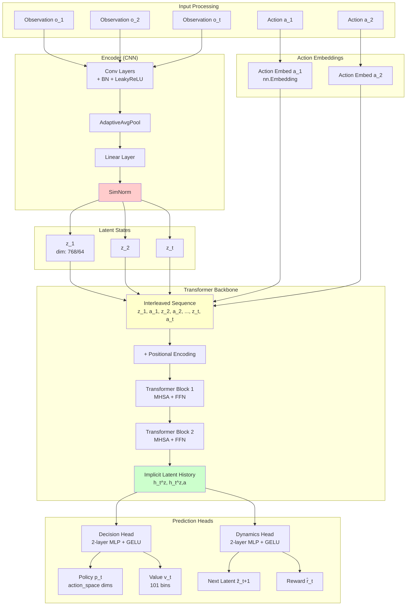
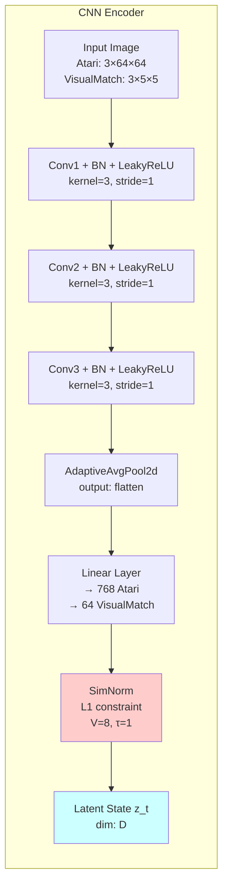
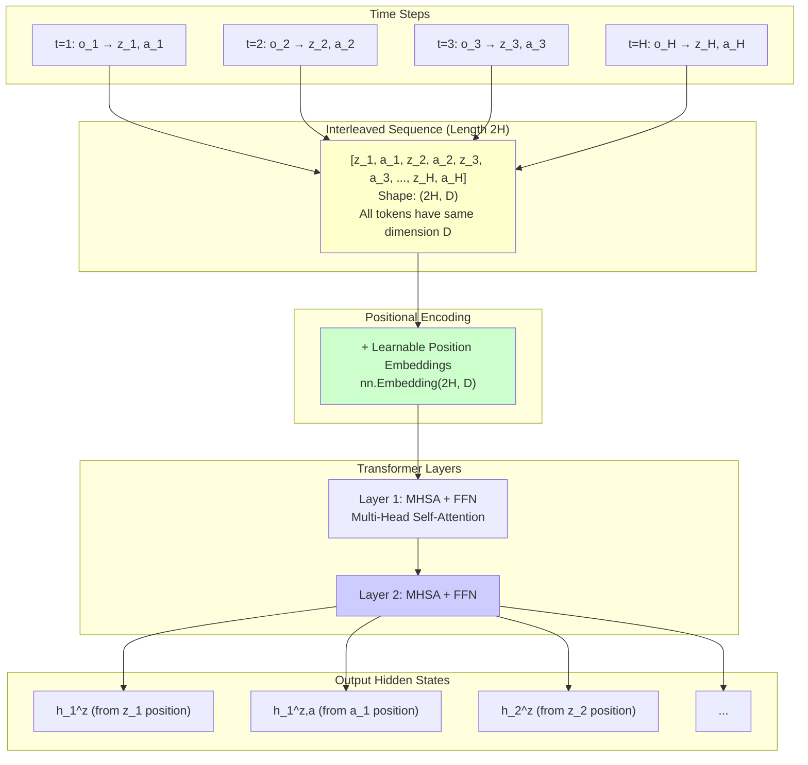
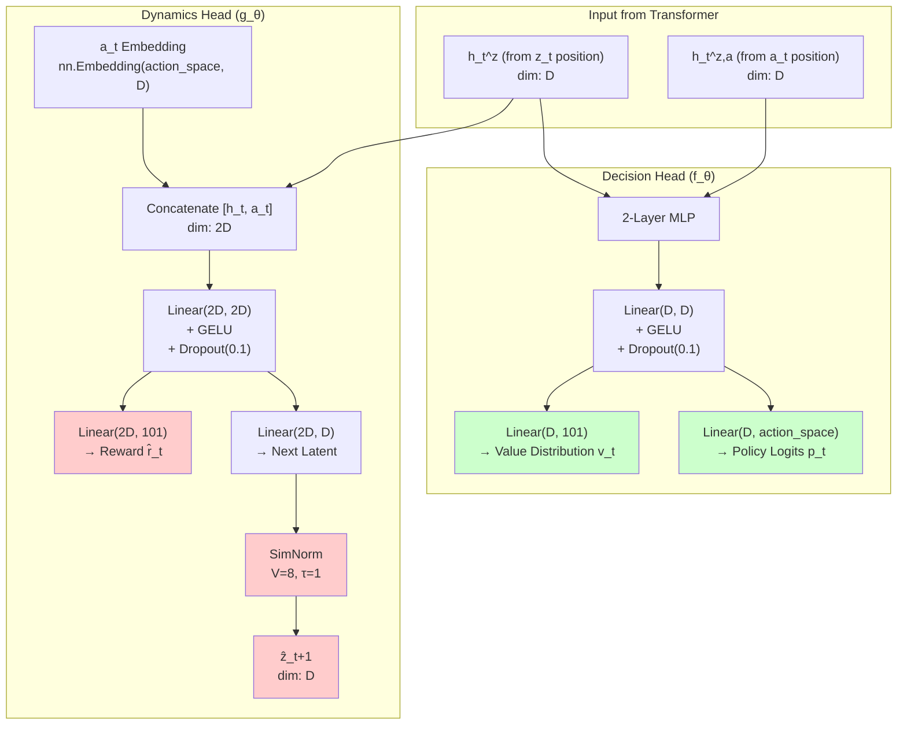
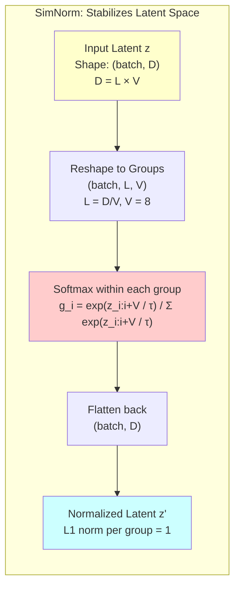

# UniZero Research Summary and Implementation Plan

**Date**: 2026-01-15
**Paper**: UniZero: Generalized and Efficient Planning with Scalable Latent World Models (arXiv:2406.10667v2)
**Codebase**: LightZero (https://github.com/opendilab/LightZero)

---

## 1. Executive Summary

UniZero is a next-generation model-based RL algorithm that addresses two fundamental limitations of MuZero-style architectures:

1. **Entanglement Problem**: MuZero's recursive latent states are tightly coupled with historical information, preventing effective self-supervised learning.
2. **Under-utilization Problem**: MuZero only uses the first observation in a trajectory during training, wasting valuable sequence data.

**Key Innovation**: UniZero employs a **modular transformer-based world model** that explicitly **disentangles latent states from implicit history**, enabling:
- Full utilization of trajectory data during training
- Effective self-supervised regularization
- Superior performance on long-term memory tasks and multitask learning

**Relevance to Trigo**: Our current Transformer-based architecture (LlamaCausalLM) already implements many UniZero principles naturally through KV cache mechanisms. We can adopt specific techniques to further improve sample efficiency and stability.

---

## 2. UniZero Core Architecture

### 2.1 Three-Component Design

```
┌─────────────────────────────────────────────────────┐
│                  UniZero World Model                 │
├─────────────────────────────────────────────────────┤
│                                                       │
│  1. Encoder h(o_t) → z_t                             │
│     • Maps observations to latent states             │
│     • Independent encoding (no recursion)            │
│                                                       │
│  2. Transformer Backbone                             │
│     • Processes sequences: [z_0, a_0, z_1, a_1, ...] │
│     • Maintains implicit history via attention       │
│     • KV cache for efficient inference               │
│                                                       │
│  3. Prediction Heads                                 │
│     • Dynamics Head: g(h_t, a_t) → z_{t+1}, r_t      │
│     • Decision Head: f(h_t) → p_t, v_t               │
│                                                       │
└─────────────────────────────────────────────────────┘
```

### 2.2 Key Differences from MuZero

| Aspect | MuZero | UniZero |
|--------|---------|---------|
| **State Representation** | Recursive: s^k = g(s^{k-1}, a^k) | Independent: z_t = h(o_t) |
| **History Modeling** | Entangled in latent state | Separate implicit history h_t |
| **Training Data** | First observation only | Full trajectory sequence |
| **Self-Supervised Loss** | Incompatible (entanglement) | Compatible (disentanglement) |
| **Architecture** | 3 MLPs (h, g, f) | Transformer + Heads |
| **Inference Context** | Limited/Accumulated errors | Full KV cache (H_infer steps) |

### 2.3 Training Objective (UniZero Equation 3)

```python
L_UniZero = Σ_{t=0}^{H-1} [
    β_z * ||ẑ_{t+1} - sg(target_encoder(o_{t+1}))||²   # Latent prediction
    + β_r * CE(r̂_t, r_t)                                 # Reward prediction
    + β_p * CE(p_t, π_t)                                 # Policy distillation
    + β_v * CE(v_t, v̂_t)                                 # Value prediction
]
```

**Key Components**:
- **β_z term (NEW)**: Self-supervised latent dynamics prediction
- **Target network**: EMA of encoder for stable targets
- **SimNorm**: L2 normalization for latent stability (critical!)

### 2.4 Detailed Architecture Diagrams

#### 2.4.1 Complete UniZero Architecture



#### 2.4.2 Encoder Architecture (Atari/VisualMatch)



#### 2.4.3 Sequence Formation and Transformer Processing



#### 2.4.4 Decision Head and Dynamics Head Architecture



#### 2.4.5 Training vs Inference Flow

```mermaid
graph TB
    subgraph "Training Phase"
        TRAJ["Trajectory from Buffer<br/>(o_0, a_0, r_0, ..., o_H, a_H)"]

        ENC_T["Encoder: z_t = h_θ(o_t)<br/>for all t in [0, H]"]

        TRANS_T["Transformer: Process full sequence<br/>[z_0, a_0, z_1, a_1, ..., z_H, a_H]"]

        PRED_T["Predict at each step t:<br/>• p_t, v_t from decision head<br/>• ẑ_t+1, r̂_t from dynamics head"]

        LOSS_T["Compute Losses:<br/>β_p·CE(p_t, π_t) + β_v·CE(v_t, v̂_t)<br/>+ β_z·||ẑ_t+1 - target_z_t+1||²<br/>+ β_r·CE(r̂_t, r_t)"]
    end

    subgraph "Inference Phase (MCTS)"
        OBS_I["Current Observation o_t"]

        ENC_I["Encoder: z_t = h_θ(o_t)"]

        KV["KV Cache<br/>History: [z_t-H, a_t-H, ..., z_t-1, a_t-1]"]

        ROOT["Root Node = z_t"]

        MCTS_SIM["MCTS Simulation Loop"]

        SIM_DYN["Dynamics Head: ẑ_t+1 = g_θ(z_t, a_t)<br/>Internal node simulation"]

        SIM_DEC["Decision Head: p_t, v_t = f_θ(h_t)<br/>Evaluate node"]

        VISIT["Accumulate visit counts N(z_t, a_t)"]

        POLICY["Improved Policy: π_t ∝ N^1/T"]
    end

    TRAJ --> ENC_T --> TRANS_T --> PRED_T --> LOSS_T

    OBS_I --> ENC_I --> ROOT
    KV --> ROOT --> MCTS_SIM

    MCTS_SIM --> SIM_DYN
    MCTS_SIM --> SIM_DEC
    SIM_DYN --> VISIT
    SIM_DEC --> VISIT
    VISIT --> POLICY

    style LOSS_T fill:#ffcccc
    style POLICY fill:#ccffcc
```



#### 2.4.6 SimNorm Operation (Critical Component)



**Key Points**:
1. **Encoder outputs z_t** - independent of history, only from current observation
2. **Transformer learns h_t** - implicit latent history via attention
3. **Decision head uses h_t** - NOT raw z_t
4. **Dynamics head predicts next z** - self-supervised learning signal
5. **SimNorm is critical** - applied after encoder and dynamics head

---

## 3. Trigo Architecture Mapping

### 3.1 Current Trigo Implementation

```python
# Trigo Model (LlamaCausalLM)
class TrigoModel:
    embed_tokens        # ← Encoder (tokens → embeddings)
    transformer_layers  # ← Transformer backbone
    policy_head         # ← Decision head (policy)
    value_head          # ← Decision head (value)
    # MISSING: Dynamics head!
```

### 3.2 UniZero Components in Trigo

| UniZero Component | Trigo Equivalent | Status |
|-------------------|------------------|--------|
| **Encoder h** | `embed_tokens` | ✅ Exists |
| **Transformer Backbone** | Llama layers | ✅ Exists |
| **Implicit History h_t** | **KV Cache** | ✅ Exists |
| **Decision Head f** | `policy_head + value_head` | ✅ Exists |
| **Dynamics Head g** | — | ❌ **Missing** |

**Key Insight**: Trigo already implements the UniZero paradigm through its Transformer architecture! The KV cache naturally serves as the "implicit history" that UniZero describes.

**Main Gap**: No explicit latent dynamics prediction (the β_z term in loss function).

---

## 4. Implementation Plan

### 4.1 Core Addition: Latent Dynamics Head

#### Overview

Add a dynamics head that predicts the next latent state given current state and action.

#### Architecture Design

```python
class TrigoWithDynamics(nn.Module):
    def __init__(self, base_model, config):
        super().__init__()
        self.base_model = base_model  # Existing LlamaCausalLM
        self.hidden_size = config.hidden_size
        self.action_space = 26  # 5×5×1 board + pass

        # ============ NEW COMPONENTS ============

        # 1. Dynamics Head
        self.dynamics_head = nn.Sequential(
            nn.Linear(self.hidden_size * 2, self.hidden_size * 2),
            nn.GELU(),
            nn.Dropout(0.1),
            nn.Linear(self.hidden_size * 2, self.hidden_size),
            SimNorm(simnorm_dim=8)  # UniZero's stability trick
        )

        # 2. Action Embedding (action-level, not token-level)
        self.action_embedding = nn.Embedding(self.action_space, self.hidden_size)

        # 3. Target Network (EMA for stable targets)
        self.target_base = copy.deepcopy(base_model)
        for param in self.target_base.parameters():
            param.requires_grad = False
```

#### Forward Pass

```python
def forward(self, tokens, action_boundaries, action_indices, return_dynamics=False):
    """
    Args:
        tokens: [batch, seq_len] Token sequence
        action_boundaries: [batch, num_actions] End position of each action
        action_indices: [batch, num_actions] Action IDs (0-25)

    Returns:
        policy_logits: [batch, num_actions, action_space]
        values: [batch, num_actions, 1]
        pred_next_hiddens: [batch, num_actions-1, hidden_size] (if return_dynamics)
    """
    # 1. Get token-level hidden states
    outputs = self.base_model(tokens, output_hidden_states=True)
    hidden_states = outputs.hidden_states[-1]  # [batch, seq_len, hidden]

    # 2. Extract action-level hidden states (at boundaries)
    action_hiddens = self.extract_action_hiddens(hidden_states, action_boundaries)
    # [batch, num_actions, hidden]

    # 3. Policy & Value (existing)
    policy_logits = self.base_model.policy_head(action_hiddens)
    values = self.base_model.value_head(action_hiddens)

    if not return_dynamics:
        return policy_logits, values

    # 4. Dynamics Prediction (NEW)
    # Current state: z_t
    current_hiddens = action_hiddens[:, :-1, :]  # [batch, T-1, hidden]

    # Next action: a_t
    next_actions = action_indices[:, 1:]  # [batch, T-1]
    action_embeds = self.action_embedding(next_actions)  # [batch, T-1, hidden]

    # Predict: ẑ_{t+1} = dynamics(z_t, a_t)
    dynamics_input = torch.cat([current_hiddens, action_embeds], dim=-1)
    pred_next_hiddens = self.dynamics_head(dynamics_input)

    return policy_logits, values, pred_next_hiddens
```

#### Loss Function

```python
def compute_loss(self, batch):
    """
    Args:
        batch: {
            'tokens': [batch, seq_len],
            'action_boundaries': [batch, num_actions],
            'action_indices': [batch, num_actions],
            'policy_targets': [batch, num_actions],
            'value_targets': [batch, num_actions],
        }
    """
    # Forward
    policy_logits, values, pred_next_hiddens = self.model(
        batch['tokens'],
        batch['action_boundaries'],
        batch['action_indices'],
        return_dynamics=True
    )

    # 1. Policy Loss (existing)
    policy_loss = F.cross_entropy(
        policy_logits[:, :-1].reshape(-1, self.action_space),
        batch['policy_targets'][:, 1:].reshape(-1)
    )

    # 2. Value Loss (existing)
    value_loss = F.mse_loss(
        values[:, :-1].squeeze(-1),
        batch['value_targets'][:, 1:]
    )

    # 3. Latent Dynamics Loss (NEW)
    with torch.no_grad():
        target_hiddens = self.target_model.get_action_hiddens(
            batch['tokens'],
            batch['action_boundaries']
        )[:, 1:, :]

    latent_loss = F.mse_loss(pred_next_hiddens, target_hiddens)

    # Total Loss
    total_loss = (
        1.0 * policy_loss +
        0.25 * value_loss +
        0.5 * latent_loss  # β_z weight (tunable)
    )

    # Update target network (EMA)
    self.update_target_network(tau=0.995)

    return total_loss, {
        'policy_loss': policy_loss.item(),
        'value_loss': value_loss.item(),
        'latent_loss': latent_loss.item()
    }
```

### 4.2 Critical Component: SimNorm

```python
class SimNorm(nn.Module):
    """
    Simplified Normalization from UniZero paper.
    Applies L2 normalization within groups to stabilize latent space.

    Critical for training stability according to UniZero ablation studies.
    """
    def __init__(self, simnorm_dim=8):
        super().__init__()
        self.simnorm_dim = simnorm_dim

    def forward(self, x):
        # x: [batch, seq_len, hidden_dim]
        shp = x.shape
        x = x.view(*shp[:-1], -1, self.simnorm_dim)

        # L2 normalize within each group
        x = F.normalize(x, p=2, dim=-1)

        return x.view(*shp)
```

**Application Points** (from LightZero code):
1. After encoder output
2. After dynamics head output

### 4.3 Token-Action Alignment (Trigo-Specific Challenge)

#### Problem

Trigo uses variable-length token sequences for actions:

```
Actions:  ["aa",    "b0",    "00",    "pass"]
Tokens:   ['a','a', 'b','0', '0','0', 'pass']
Indices:  [1,  2,   3,  4,   5,  6,   7    ]
```

- Most actions = 2 tokens
- "pass" = 1 token
- Action boundaries are irregular

#### Solution: Action Boundary Tracking

```python
class TrigoDataProcessor:
    def process_game(self, game_moves):
        """
        Args:
            game_moves: ["aa", "b0", "00", "pass", "zz"]

        Returns:
            {
                'tokens': [<start>, 'a', 'a', 'b', '0', '0', '0', 'pass', 'z', 'z'],
                'action_boundaries': [0, 2, 4, 6, 7, 9],
                'action_indices': [0, decode("aa"), decode("b0"), decode("00"), decode("pass"), decode("zz")]
            }
        """
        tokens = [START_TOKEN]
        action_boundaries = [0]  # Initial position
        action_indices = [0]     # Initial state (no action)

        current_pos = 1
        for move in game_moves:
            # Tokenize move
            move_tokens = self.tokenizer.encode_move(move)
            tokens.extend(move_tokens)

            # Record action boundary (last token position)
            current_pos += len(move_tokens)
            action_boundaries.append(current_pos - 1)

            # Record action ID (decode TGN to board position)
            action_id = self.move_to_action_id(move)  # 0-25
            action_indices.append(action_id)

        return {
            'tokens': tokens,
            'action_boundaries': action_boundaries,
            'action_indices': action_indices
        }

    def move_to_action_id(self, move):
        """Convert TGN move to action ID (0-25)"""
        if move == "pass":
            return 25

        x, y, z = decode_tgn(move)  # e.g., "aa" → (0, 0, 0)
        return x * 5 + y  # Assume z=0 for 5×5×1 board
```

### 4.4 MCTS Integration (Optional)

Using learned dynamics in MCTS tree simulation:

```python
class MCTSNode:
    def expand_with_dynamics(self, model, action):
        """Simulate action in learned latent space"""
        with torch.no_grad():
            # 1. Get action embedding
            action_embed = model.action_embedding(torch.tensor([action]))

            # 2. Predict next latent state
            dynamics_input = torch.cat([self.latent_state, action_embed], dim=-1)
            next_latent = model.dynamics_head(dynamics_input)

            # 3. Predict policy & value from next latent
            policy_logits, value = model.predict_from_latent(next_latent)

        child = MCTSNode(latent_state=next_latent)
        return child, policy_logits, value
```

**Note**: This is optional and should be validated against using true game rules.

---

## 5. Implementation Roadmap

### Phase 1: Proof of Concept (1-2 days)

**Goal**: Verify that latent prediction is trainable and loss decreases.

**Tasks**:
- [ ] Implement simplified dynamics head (without action boundaries)
- [ ] Assume all actions are 2 tokens (ignore "pass")
- [ ] Add latent loss term to training loop
- [ ] Monitor convergence on small dataset

**Success Criteria**: Latent loss converges below 0.1 after 10k steps.

---

### Phase 2: Full Implementation (3-5 days)

**Goal**: Complete implementation with all UniZero components.

**Tasks**:
- [ ] Implement action boundary tracking in data processor
- [ ] Handle variable-length actions (pass = 1 token, others = 2)
- [ ] Add SimNorm to encoder and dynamics head
- [ ] Implement EMA target network
- [ ] Add `β_z` hyperparameter to config
- [ ] Update training loop with latent loss

**Components to Add**:
```python
# File: trigor/models/llamaCausalLM.py
class LlamaCausalLMWithDynamics(LlamaCausalLM):
    # Add dynamics head, target network, etc.

# File: trigor/training/trainer.py
class TrigoTrainer:
    # Update compute_loss() to include latent_loss

# File: trigor/data/processor.py
class TrigoDataProcessor:
    # Add process_game() with action boundary tracking

# File: trigor/models/layers.py
class SimNorm(nn.Module):
    # Add SimNorm implementation
```

**Success Criteria**:
- Train on 1000 games without errors
- All losses converge
- Action boundaries correctly tracked

---

### Phase 3: Evaluation (3-5 days)

**Goal**: Measure impact on sample efficiency and performance.

**Experiments**:

1. **Ablation Study**: Compare with/without latent prediction
   - Baseline: Current Trigo model
   - Variant A: + Latent loss
   - Variant B: + Latent loss + SimNorm

2. **Sample Efficiency**: Measure performance at different training budgets
   - 100k, 500k, 1M training steps
   - Compare: games to reach 50% win rate vs random

3. **Latent Space Quality**: Visualize learned representations
   - t-SNE plots of latent states
   - Latent prediction accuracy over time
   - Consistency between predicted and true latents

**Metrics**:
- Sample efficiency (games to convergence)
- Final performance (Elo rating)
- Training stability (loss variance)
- Latent prediction accuracy (MSE)

---

### Phase 4: MCTS Integration (5-7 days, Optional)

**Goal**: Use learned dynamics in MCTS tree search.

**Tasks**:
- [ ] Implement `expand_with_dynamics()` in MCTS node
- [ ] Compare learned dynamics vs true rules
- [ ] Hybrid approach: use learned dynamics for deep simulations
- [ ] A/B test performance

**Success Criteria**: Learned dynamics achieves >90% accuracy compared to true rules in simulation.

---

## 6. Expected Benefits

Based on UniZero and EfficientZero papers:

| Metric | Without Latent Prediction | With Latent Prediction | Improvement |
|--------|--------------------------|------------------------|-------------|
| **Sample Efficiency** | Baseline | 1.1-1.3× | +10-30% |
| **Training Stability** | Moderate | High | Significant |
| **Final Performance** | Baseline | 1.05-1.15× | +5-15% |
| **Long-term Memory** | Weak | Strong | Significant |

**Trigo-Specific Expected Gains**:
- Better modeling of 30-step game sequences
- More stable training (SimNorm effect)
- Improved value estimation through self-supervised learning
- Potential MCTS tree search improvements

---

## 7. Key Hyperparameters

```yaml
# Config additions
model:
  use_dynamics_prediction: true
  dynamics_hidden_multiplier: 2  # 2× hidden_size in dynamics head
  simnorm_dim: 8

training:
  # Loss weights (β coefficients)
  beta_policy: 1.0
  beta_value: 0.25
  beta_latent: 0.5  # Key tunable parameter (UniZero uses 0.1-1.0)

  # Target network
  target_network_tau: 0.995  # EMA decay rate
  target_update_frequency: 1  # Update every step

  # Context length
  train_context_length: 16  # Sequence length for training
  infer_context_length: 32  # History length for inference
```

**Tuning Guide**:
- Start with `β_latent = 0.5`
- If latent loss dominates, reduce to 0.1-0.3
- If latent loss plateaus high, increase to 0.7-1.0
- SimNorm dimension should divide `hidden_size` evenly

---

## 8. Risks and Mitigations

### Risk 1: Token-Action Alignment Complexity

**Issue**: Variable-length token sequences complicate dynamics prediction.

**Mitigation**:
- Start with simplified assumption (all actions = 2 tokens)
- Implement full boundary tracking in Phase 2
- Alternative: Use action-level tokens (1 token per action)

### Risk 2: Computational Overhead

**Issue**: Additional dynamics head increases training time.

**Mitigation**:
- Dynamics head is lightweight (2-layer MLP)
- Expected overhead: 5-10% training time
- Can disable dynamics during inference (only used in training)

### Risk 3: Hyperparameter Sensitivity

**Issue**: `β_latent` weight requires tuning.

**Mitigation**:
- Start with UniZero's default (0.5)
- Grid search: [0.1, 0.3, 0.5, 0.7, 1.0]
- Monitor latent loss convergence

### Risk 4: No Immediate Performance Gain

**Issue**: Latent prediction may not improve short-term performance.

**Mitigation**:
- Focus on sample efficiency (games to convergence)
- Benefits more apparent in long-term memory tasks
- Consider as infrastructure for future 3D version

---

## 9. Alternative Approaches

### Alternative 1: Simplified Token Representation

**Idea**: Use single token per action (action-level vocabulary).

```python
vocab = {
    '<start>': 0,
    '<action_aa>': 1,
    '<action_ab>': 2,
    ...
    '<action_pass>': 26,
}
```

**Pros**:
- Perfect token-action alignment
- Simpler implementation

**Cons**:
- Larger vocabulary (~230 vs ~40)
- Less compositional structure
- Harder to scale to different board sizes

### Alternative 2: Use Separator Tokens

**Idea**: Insert `<sep>` token after each action.

```python
tokens = [<start>, 'a', 'a', <sep>, 'b', '0', <sep>, ...]
```

**Pros**:
- Easy boundary detection
- Preserves character-level structure

**Cons**:
- Longer sequences (+33% length)
- Extra processing in training/inference

---

## 10. References

### Papers

1. **UniZero** (Pu et al., 2024): https://arxiv.org/abs/2406.10667
   - Main paper for this implementation plan

2. **MuZero** (Schrittwieser et al., 2019): https://arxiv.org/abs/1911.08265
   - Original model-based RL with learned dynamics

3. **EfficientZero** (Ye et al., 2021): https://arxiv.org/abs/2111.00210
   - Self-supervised consistency loss (SSL)

4. **SimNorm** (Chen & He, 2021): https://arxiv.org/abs/2011.10566
   - Similarity-based normalization technique

### Codebases

1. **LightZero**: https://github.com/opendilab/LightZero
   - Official UniZero implementation
   - Reference: `lzero/model/unizero_model.py`
   - Reference: `lzero/model/unizero_world_models/world_model.py`

2. **Trigo RL** (Current project): `/home/camus/work/trigoRL/`
   - Transformer-based architecture
   - LlamaCausalLM with policy/value heads

---

## 11. Conclusion

UniZero represents a significant advancement in model-based RL by addressing fundamental limitations of MuZero through transformer-based world models. The key insight—disentangling latent states from implicit history—enables better utilization of training data and more effective self-supervised learning.

**For Trigo**: Our current architecture already implements many UniZero principles naturally. The main addition needed is an explicit **latent dynamics prediction head** with **self-supervised regularization**. This is a low-risk, high-reward enhancement that can be implemented incrementally.

**Recommended Action**: Proceed with Phase 1 (Proof of Concept) to validate the approach on Trigo's architecture, then iterate based on empirical results.

---

## Appendix A: Code Structure

```
trigoRL/
├── trigor/
│   ├── models/
│   │   ├── llamaCausalLM.py
│   │   ├── llamaCausalLMWithDynamics.py  # NEW
│   │   └── layers.py
│   │       └── SimNorm  # NEW
│   ├── training/
│   │   └── trainer.py  # UPDATE: add latent_loss
│   ├── data/
│   │   └── processor.py  # UPDATE: add action boundary tracking
│   └── mcts/
│       └── node.py  # OPTIONAL: add expand_with_dynamics()
├── configs/
│   └── training_with_dynamics.yaml  # NEW
├── docs/
│   └── unizero-research-and-plan.md  # THIS FILE
└── experiments/
    └── dynamics_ablation/  # NEW
        ├── baseline.yaml
        ├── with_latent.yaml
        └── with_latent_simnorm.yaml
```

---

**Document Version**: 1.0
**Last Updated**: 2026-01-15
**Author**: Claude Code (based on UniZero paper research)
